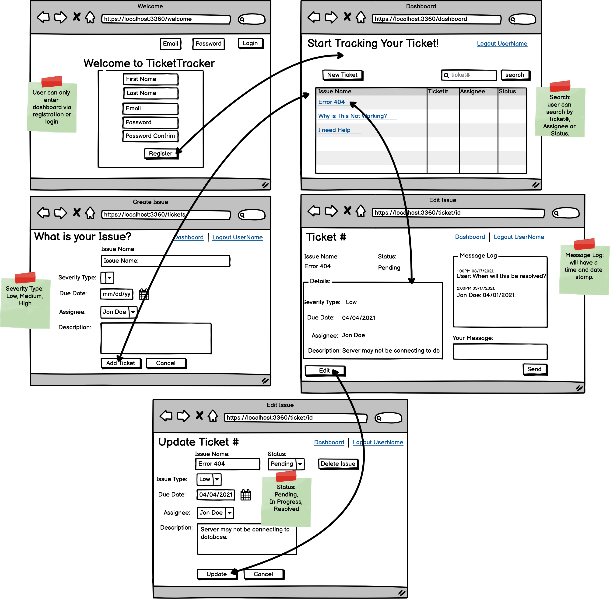

# TicketTracker
Ticketing management tool that processes and catalogs users issue requests that deal with incidents, changes and issues to optimize workflow. 
## Features 
- Tickets can be assigned and reassigned to different users.
- Users can search for ticket Status using search bar.
- Users can add messages to tickets and communicate to each other about ticket status. 
- User must authenticate using login/registration before using application. 
## Demo
<p align="center">
  
</p>
<hr/>

## Wireframe
<p align="center">
  
</p>
<hr/>

## Technology Used 
- Integrated Java BCrypt encryption and session management to authenticate user login and registration.
- Engineered data models leveraging Spring Data JPA such as 1:N and N:N relationships within MySQL to connect users, allowing for ticket messaging.
- Designed responsive frontend using Bootstrap for a minimalistic and smooth user interface.


## Getting Started
1. Fork and clone from this repository onto your local machine.
```bash
$ git clone https://github.com/devJimmyLam/TicketTracker.git
```
2. Install the required dependencies:
* [JDK 8](http://www.oracle.com/technetwork/java/javase/downloads/jdk8-downloads-2133151.html/) 
* [Spring Tool Suite (STS)](https://spring.io/tools/)
* [MySQL Workbench](https://dev.mysql.com/downloads/workbench/#downloads)
* [MAMP](https://www.mamp.info/en/mac/)

4. Apache Maven Installation for Mac
```bash
brew install maven
```
5. Apache Maven Installation for Windows
 - 1. Download the latest version of Maven from this link: [Apache Mavern](http://maven.apache.org/download.cgi.) It is better and easier to just grab the .zip file for easy extraction.
Installation

 - 2. Follow the download instructions depending on your laptop/computer's operating system. For windows, download from the Binary zip archive

 - 3. The installation of Apache Maven is a simple process of extracting the archive and adding the bin folder with the mvn command to the PATH.Make sure that JAVA_HOME environment variable is set and points to the JDK installing folder.
 
 6. To configure our application to connect to data source, we need to check the information below on how to connect to your <SCHEMA> via src/main/resources/application.properties
```
spring.datasource.url=jdbc:mysql://localhost:8080/<<YOUR_SCHEMA>>
spring.datasource.username=<<dbuser>>
spring.datasource.password=<<dbpassword>>
spring.datasource.driver-class-name=com.mysql.jdbc.Driver
spring.jpa.hibernate.ddl-auto=update
```
The first setting updates our schema with any changes we make to our domain model. There are other options you can explore, but it is an easy default to start with. Just remember that you need to have the schema created beforehand, and if you make mistakes in setting up, you may need to drop your schema.

That's it! You're connected now; if you try and start your project, it will throw an error if you don't have it set up correctly (provided you have the right dependencies).

7. Start your sever
- right click on project and Run As Spring Boot APP
- connect to localhost:8080 to view application.

8. Go track your tickets!


## Built With
* Front-End
  * [HTML](https://html.com/)
  * [CSS](https://developer.mozilla.org/en-US/docs/Web/CSS)
  * [Bootstrap](https://getbootstrap.com/docs/5.0/getting-started/introduction/)
* Back-End
  * [Java](https://www.oracle.com/java/technologies/)
  * [Spring](https://spring.io/projects/spring-framework)
* Testing
  * [Spring Tool Suite (STS)](https://spring.io/tools/)

## Contributing
Please feel free to fork from this repository, make pull requests and help improve the game by sending suggestions to dev.jimmylam@gmail.com
